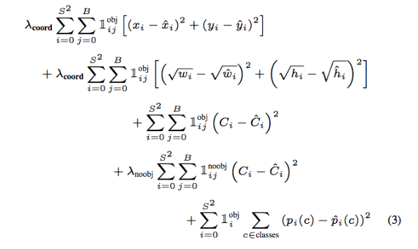

# YOLO(You Only Look Once: Unified, Real-Time Object Detection)
YOLO Paper : [Here](https://pjreddie.com/media/files/papers/yolo.pdf)
YOLO 9000 Paper : [Here](https://arxiv.org/abs/1612.08242)

---


# YOLOv1

## 요약

Object detection에 대한 새로운 접근법 YOLO 등장!! YOLO는 Object detection을 하기 전에 사전 작업으로 detection을 수행한다. YOLO는 공간적으로 분리된 bounding box와 class에 대한 확률을 regression으로 풀어낸다. 전체적인 detection 파이프라인은 단일 네트워크이기 때문에 검출 성능은 End-to-End로 최적화 될 수 있다.

- 통합된 아키텍쳐를 이용해 매우 빠르다
- 초당 45 프레임에 실시간 이미지 처리가 가능하다.
- Fast YOLO 같은 경우 초당 155 프레임이 나온다. 또한 다른 모델들 보다 2배의 mAP(평균 정확도)를 가진다.
- localization error가 조금 더 높지만 예측에서는 오류가 적다.
- DPM이나 R-CNN 보다 자연스러운 이미지에서 일반적인 것을 학습하는데 결과가 더 좋다.

---

## 개요
인간은 이미지를 훑어보고 즉시 object가 무엇인지 파악한다.


- 448x448 이미지
- 단일 CNN

### R-CNN
- 영상에서 잠재적인 bounding box를 생성한 다음 제안된 box에서 분류기를 실행하는 지역 region proposal을 사용한다. 분류 후 후처리는 장면의 다른 객체를 기반으로 하여 bounding box를 정제하고 중복 탐지를 제거하며 box를 다시 탐색하는데 사용하게 한다.

- 이런 복잡한 pipe line은 각각의 요소들을 별도로 학습시켜야 하기 때문에 느리고 최적화가 어렵다.

### yolo
- 매우 빠르다
- 예술 작품으로 추론하였을 때 YOLO는 DPM과 R-CNN과 같은 검출 방법을 크게 능가한다. -> 일반적인 특징을 잘 학습한다.

---

## end to end
- 신경망은 한쪽 끝에서 입력을 받아들이고 다른 쪽 끝에서 출력을 생성하는데, 입력 및 출력을 직접 고려하여 네트워크 가중치를 최적화 하는 학습을 `end-to-end`라고 한다.

</br>

- Convolutional neural network 가 카메라의 원시 픽셀을 명령어에 직접 매핑하는 과정을 거치게 될 때 역전파는 종종 입력을 해당 출력으로 매핑하는 것과 관련하여 네트워크 가중치를 학습하는 효율적인 방법으로 사용된다.

</br>

- **신경망에 너무 많은 계층의 노드가 있거나 메모리가 적합하지 않을 경우 end-to-end 방식으로 훈련 시킬 수 없다.** 이 경우 네트워크를 더 작은 네트워크의 파이프라인으로 나누어 해결 할 수 있는데 각 작은 네트워크는 독립적으로 훈련을 하게 되고 원하는 출력을 얻기 위해 연결 될 수 있다. 이러한 방식을 Divide and train 이라고 한다. 최적화가 중간 산출물에 의존한다는 점에서 국지적으로 수행이 되기 때문에 최적의 결과를 보장할 수 없다.

---

## 통합 검출(Unified Detection)
- YOLO는 single neural network를 사용하고 객체 검출에서 분할된 component 들을 통합시킨다. 전체 이미지에서 예측한 각각의 bounding box를 feature로 사용한다. 그리고 그 feature들을 예측하고 탐지하는데 사용한다. 이것은 image에서 모든 객체와 전체 image 에 대해서 globally한 원인이 있음을 의미한다.

- YOLO의 디자인은 높은 평균 정밀도를 유지하면서 end-to-end train과 실시간 검출을 가능하게 한다.

- input image를 `S x S grid`로 나눈다. 만약 object의 중심이 `grid cell`에서 떨어지면, 그 `grid cell`은 object의 detection를 담당한다. 각각의 `grid cell`은 B bounding box와 해당 bounding box에 대한 confidence score를 예측한다. 즉, 모델이 얼만큼 박스안에 물체가 있다고 생각하는지에 대한 정확도를 표시하는 요소다.

```
confidence 를 수식으로 표현

confidence score = probability(object) * IOU(truth, predict)
```

- 각 bounding box는 5가지 요소(x,y,w,h,confidence score)로 구성이 되어있다. x와 y는 `grid cell`의 경계를 기준으로한 bounding box의 중심 좌표이며 w와 h는 예측된 object와 전체 이미지의 폭과 높이의 비율을 의미한다. 또한 각 `grid cell`은 해당 cell에 어떤 class가 있는지 예측한다. 예측된 boxing의 개수와 상관없이 한가지 종류의 class의 확률만을 계산한다.

```
class의 조건부 확률

C = probability(class | object)
```

```
test

probability(class | object) * probability(object) * IOU(truth, predict) = probability(class) * IOU(truth, predict)
```


- 마지막 tensor의 size : `S x S x (B * 5 + C)`
- S x S : 7 x 7
- bounding box 개수 B : 2
- class 개수 C : 20
- result tensor size : 7x7x30

---

## 네트워크 디자인(Network Design)
- Network : CNN
- Dataset : PASCAL VOC
- Fully connected layer : 확률,좌표
- GooLeNet에 영향을 받았다.
- convolution layer 24개
- fully connected layer 2개
- reduction layer 1개와 convolution layer(3x3) 1개

위에 layer를 사용하면 layer를 지날 때마다 feature 공간이 줄어들고 imagenet classification task의 절반의 해상도(224x224)를 이용하여 convolution layer를 미리 학습하고, detection을 위해서 해당 resolution을 2배로 올렸습니다.


- fast YOLO는 9개의 convolution layer를 사용하고 network의 크기나 학습, 테스트 parameter들은 기존 YOLO와 동일하다.

---

## 학습(Train)
- imageNet 1000-class competition 데이터셋으로 pretrain시킨다.
- pretrain의 경우 위에 그림에서 처음 20개의 convolution layer를 사용하고, 이어서 average-pooling layer와 fully connected layer를 사용한다. 정확도가 88%정도에 이를 때까지 1주일 동안 학습시켰다.
- 그 후 pretrain된 network에 convolution layer와 connected layer를 추가하면 성능이 향상된다는 논문이 나와서 4개의 convolution layer 와 2개의 fully connected layer에게 random initialized weight를 주어서 추가 시켰다.
- 세부적인 시각정보가 중요해서 이미지를 224x224에서 448x448로 올렸다.
- bounding box의 폭과 높이를 정규화(0~1)하였다.
- 마지막 layer에 linear activation function을 사용하였고 나머지 다른 layer에는 leaky relu를 사용한다.

## 최적화(optimizer)
- ouput의 sum-squared error를 최적화 한다. sum-squared error를 사용하면 최적화 하기 쉽지만 YOLO의 목적은 average precision을 최대화 하는 것 이기 때문에 완전히 맞지 않는다.(Localization error와 classification error에 동일한 가중치를 주기 때문)

- 모든 영상에서 어떤 물체도 포함하지 않는 `grid cell`이 많다. 이러한 현상 때문에 confidence score가 0으로 수렴하게 된다.

- 위에 문제를 해결하기 위해서 bounding box 좌표 예측 loss를 증가시키고 객체가 포함되지 않는 bounding box의 예측 loss를 감소시킨다.

- 또한 sum-squared error를 사용하면 큰 bounding box와 작은 bounding box의 오류를 똑같이 가중시킨다. 오류 측정은 큰 bounding box의 작은 편차가 작은 bounding box보다 덜 중요하다는 것을 반영해야한다. 그래서 가로와 세로를 바로 예측하는게 아니라 가로,세로의 제곱근을 예측한다.

- YOLO는 `grid cell` 당 여러가지의 bounding box를 예측한다.

-

## 손실 함수(Loss function)
- multi part loss function 





# 참조
- yolo
  + [https://mc.ai/yolounified-real-time-object-detection%EB%85%BC%EB%AC%B8%EC%9D%BD%EA%B8%B0/](https://mc.ai/yolounified-real-time-object-detection%EB%85%BC%EB%AC%B8%EC%9D%BD%EA%B8%B0/)
  + [www.modulabs.co.kr](www.modulabs.co.kr)

- yolov2
  + [http://blog.naver.com/PostView.nhn?blogId=sogangori&logNo=221011203855](http://blog.naver.com/PostView.nhn?blogId=sogangori&logNo=221011203855)

- yolov3
  + [http://hugrypiggykim.com/2018/06/04/yolov3-an-incremental-improvement/](http://hugrypiggykim.com/2018/06/04/yolov3-an-incremental-improvement/)

- end to end
  + [https://eehoeskrap.tistory.com/183](https://eehoeskrap.tistory.com/183)
